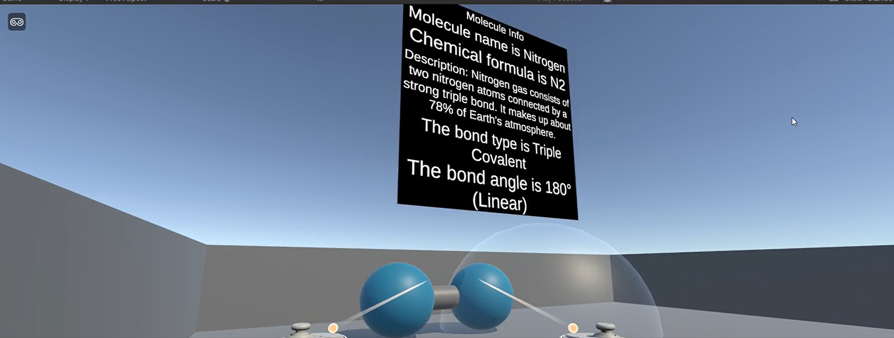

# XR Chemistry Lab Framework 🧪🥽

A **production-ready, scalable XR chemistry molecule builder framework for Unity + XR Interaction Toolkit**.

This project lets users:

* Spawn atoms from a dynamic UI
* Grab and place atoms in XR
* Detect valid molecular combinations
* Spawn completed molecules
* Show molecule educational info on hover
* Reuse atoms through object pooling
* Extend data using ScriptableObject databases

Built with **clean architecture**, **event-driven UI**, and **data-driven content pipelines**.

## 🎥 Demo
[](Demo/Chemistrylabdemo.mp4)

---

# ✨ Features

## 🧬 Molecule Building

* Drag and grab atoms in XR
* Drop inside bond zone
* Validates combinations against molecule recipes
* Supports unlimited molecules
* Molecule prefabs spawn automatically

## ⚡ Object Pooling

* Reuses spawned atoms
* Reduces GC allocations
* Better XR/mobile performance
* Safe for repeated classroom interactions

## 🗂️ Data Driven Databases

### Atom Database

Stores:

* atom type
* display name
* icon
* prefab

### Molecule Database

Stores:

* molecule type
* formula
* prefab
* bond angle
* bond type
* description
* atom requirements

## 🖥️ Dynamic UI

* Atom buttons generated from database
* No hardcoded UI buttons
* Easily expandable for new atoms

## 🌐 Localization System

* Enum-based localization keys
* `LocalizationDataSO` per language
* XML export pipeline for translators
* external language editing workflow
* runtime language switching
* fallback language support
* dynamic TMP font switching
* missing key validation
* centralized `LocalizationManager`

## 🔊 Android Voice Narration (TTS)

Built-in event-driven text-to-speech narration for educational molecule learning.

Features
Native Android / Quest TTS
free offline speech
language-aware voice profiles
pitch + speech rate control
ScriptableObject voice database
per-language voice presets
hover narration
stop speech on hover exit
localized key speech support
educational info panel narration

## 🥽 XR Hover Inspection

Hover over completed molecule to display:

* molecule name
* chemical formula
* description
* bond type
* bond angle

---

# 🏗️ Architecture

      AtomDatabase
         ↓
      AtomSpawnUIController
         ↓
      AtomPool
         ↓
      XR Atom Grab
         ↓
      BondZone
         ↓
      BondManager
         ↓
      MoleculeDatabase
         ↓
      Spawn Molecule
         ↓
      MoleculeInfoHandler
         ↓
      MoleculeUI
         ↓
      LocalizationManager
         ↓
      Speech Event System
         ↓
      Native Android TTS


# 🚀 Setup Guide

## 1) Create Databases

### Atom Database

Create:

```text
Create > XR Chemistry > Atom Database
```

Add all atoms with:

* icon
* display name
* prefab
* atom type

### Molecule Database

Create:

```text
Create > XR Chemistry > Molecule Database
```

Add all molecule ScriptableObjects.

---

## 2) Scene Setup

### Bond Zone

Add collider with `isTrigger = true`

Attach:

* `BondZone`
* reference `BondManager`

### Bond Manager

Assign:

* `MoleculeDatabase`
* `AtomPool`
* animation values

### Spawn UI

Assign:

* atom database
* content root
* atom item prefab
* spawn point
* atom pool

---

## 3) Molecule Prefabs

Each molecule prefab should contain:

* collider
* rigidbody (optional)
* `XRGrabInteractable`
* `MoleculeInteractableInfo`

This enables hover inspection.

---

# ➕ Adding New Atom

1. Add new enum value in `AtomType`
2. Add prefab
3. Add icon
4. Add to `AtomDatabase`

UI updates automatically.

---

# ➕ Adding New Molecule

1. Add new `MoleculeType`
2. Create `MoleculeData`
3. Define atom recipe
4. Assign prefab
5. Add to `MoleculeDatabase`

System auto-detects the new molecule.

---

# 📚 Educational Use Cases

Perfect for:

* XR classrooms
* chemistry labs
* molecule exploration
* self-learning apps
* quizzes
* guided lessons
* gamified science apps

---

# 🔮 Future Roadmap

* Lesson objectives
* XP rewards
* chapter progression
* Firebase save system
* multiplayer classroom
* voice tutor
* molecule quiz mode
* periodic table integration

---

# 🛠️ Tech Stack

* Unity 6+
* XR Interaction Toolkit
* ScriptableObjects
* Event-driven architecture
* Object pooling
* TextMeshPro
---

The architecture prioritizes:

* reusability
* maintainability
* high XR performance
* clean UI flow
* rapid content expansion

Perfect foundation for building a **real XR chemistry learning product**.
